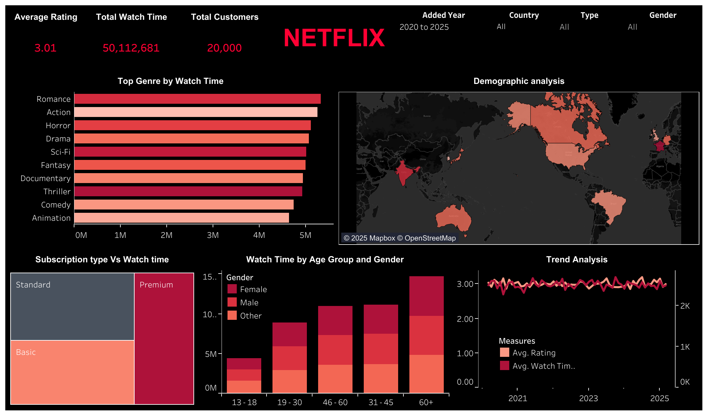

# Netflix Data Analysis

## 📊 Project Description

This interactive Tableau dashboard offers comprehensive insights into Netflix user behavior, including total watch time and average ratings. Users can filter data by:

- 📅 Year  
- 🌍 Country  
- 🎞️ Content Type (TV Series or Movies)  
- 👤 Gender

### 🔍 Key Features

- **Demographic Analysis**  
  Visualizes total users and total watch time across different countries.

- **Trend Analysis**  
  Tracks changes in average ratings and watch time over time, based on the date content was added.

- **Watch Time by Demographics**  
  Explores how watch time varies across gender and age groups.

- **Subscription Type vs Watch Time**  
  Compares different subscription types to understand their impact on user engagement.

- **Top Genres**  
  Identifies the most popular content genres based on total watch time.

  ### 🖼️ Dashboard Preview

🔗 [**View Full Dashboard on Tableau Public**](https://public.tableau.com/views/NetflixDataAnalysis_17443562779550/NETFLIX?:language=en-GB&:sid=&:display_count=n&:origin=viz_share_link)

---

🎯 **Tools Used:**  
- Tableau  
- Excel

🏷️ **Tags:** `tableau` `excel` `data cleaning` `business intelligence` `customer analysis` `content analytics` `data visualization` `EDA`
